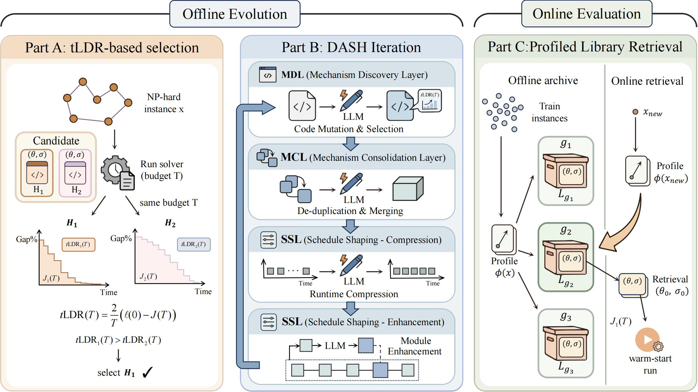

<span id='all_catelogue'></span>

# <center> DASH: Dynamics-Aware Solver Heuristics (with Profiled Library Retrieval) </center>

This repository contains the **framework + plugins** for **DASH**, an LLM-driven system for *automatic heuristic design* in combinatorial optimization.


**📢 Notice (Active Development)**  
This repository is currently under active development. Core code, execution scripts, and related materials will be uploaded soon.

---

## Highlights

- **LLM-driven solver co-evolution** across **MDL / MCL / SSL** (mechanism + schedule).
- **Trajectory-aware efficiency signals** (runtime/trajectory logging) and acceptance rules aligned with the paper design.
- **PLR (Profiled Library Retrieval)**: maintain **group-wise archives** during evolution and **warm-start** test-time runs by retrieving a specialized solver from the matched group archive.
- **Plugin-first design**: each problem lives in `plugins/<PROBLEM>/` with its own `problem.py`, `spec.py`, operators, runner, (optional) `plr.py`.

---

Our entire work flow can be summarized as follows:



---

## Getting Started

### Table of Contents

* <a href='#Environment Preparation'>1. Environment Preparation</a>  
* <a href='#Repo Structure'>2. Repo Structure</a>  
* <a href='#Data Preparation'>3. Data Preparation</a>  
* <a href='#LLM Setup'>4. LLM Setup</a>  
* <a href='#Quick Start (TSP_GLS)'>5. Quick Start (TSP_GLS)</a>  
* <a href='#Run DASH (Generic Workflow)'>6. Run DASH (Generic Workflow)</a>  
* <a href='#PLR Workflow'>7. PLR Workflow</a>  
* <a href='#Reproducing & Evaluation'>8. Reproducing & Evaluation</a>  
* <a href='#Add a New Plugin'>9. Add a New Plugin</a>  
* <a href='#FAQ & Troubleshooting'>10. FAQ & Troubleshooting</a>  

---

<span id='Environment Preparation'/>

### 1. Environment Preparation <a href='#all_catelogue'>[Back to Top]</a>

> Recommended: Python 3.10+.

```bash
# 1) Create env
conda create -n DASH python=3.10 -y
conda activate DASH

# 2) Install this repo (editable)
# Run at repo root where setup.py (or pyproject.toml) exists
pip install -U pip
pip install -e .

# 3) (Optional) install torch / accelerate depending on your runtime
# pip install torch --index-url https://download.pytorch.org/whl/cu121
# pip install accelerate
```

---

<span id='Repo Structure'/>

### 2. Repo Structure <a href='#all_catelogue'>[Back to Top]</a>

Core layout (simplified):

```text
DASH/
  src/DASH/                 # framework core
    engine/                 # evolution loop, evaluator, EC interface
    llm/                    # LLM adapters (cloud/local/HF)
    ec/                     # selection + population management
    utils/                  # logging/report/profiling helpers
    runner/                 # entrypoints
  plugins/                  # problem backbones (TSP/CVRP/MKP/BPP...)
    TSP_GLS/
    CVRP_ACO/
    MKP_ACO/
    BPP_GOA/
  Data/                     # datasets (TSPLIB/CVRPLIB/MKP...)
  Baselines/                # baseline solvers/scripts
```

---

<span id='Data Preparation'/>

### 3. Data Preparation <a href='#all_catelogue'>[Back to Top]</a>

Put datasets under `Data/`:

```text
Data/
  TSPLIB/         # TSPLIB instances / opt solutions (if needed by plugin)
  CVRPLIB/        # CVRP benchmark sets
  MKP/            # ORLIB-style MKP data
```

**Notes**
- Some plugins can also generate training instances (synthetic).
- If you run baselines (e.g., LKH3), follow the baseline’s own scripts under `Baselines/`.

---

<span id='LLM Setup'/>

### 4. LLM Setup <a href='#all_catelogue'>[Back to Top]</a>

DASH supports multiple LLM backends through `src/DASH/llm/`:
- cloud API (OpenAI-style endpoints)
- HF inference
- local server (OpenAI-compatible)

Prefer environment variables (do not hardcode keys):

```bash
export DASH_API_ENDPOINT="https://YOUR_ENDPOINT/v1/chat/completions"
export DASH_API_KEY="YOUR_KEY"
export DASH_LLM_MODEL="YOUR_MODEL_NAME"
```

Then, in your runner/config, map these into your parameter fields:
- `llm_api_endpoint`
- `llm_api_key`
- `llm_model`
- `llm_use_local` / `llm_local_url` (if using local server)

---

<span id='Quick Start (TSP_GLS)'/>

### 5. Quick Start (TSP_GLS) <a href='#all_catelogue'>[Back to Top]</a>

TSP GLS plugin lives in:

```text
plugins/TSP_GLS/
  problem.py
  prompts.py
  gls/
  utils/
  runDASH_batch.py
```

**Run**

```bash
# from repo root
python plugins/TSP_GLS/runDASH_batch.py
```

**What you should edit first**
Inside `plugins/TSP_GLS/runDASH_batch.py` (or equivalent):
- TSPLIB root path
- case list (e.g., `a280`)
- time budget / parallelism
- LLM endpoint/model parameters

---

<span id='Run DASH (Generic Workflow)'/>

### 6. Run DASH (Generic Workflow) <a href='#all_catelogue'>[Back to Top]</a>

A typical DASH workflow is:

1) Initialize a task-specific base solver (per plugin).  
2) Offline evolution over **MDL → MCL → SSL** to co-evolve:
   - **θ (mechanism)**: operators / neighborhoods / acceptance / perturbation…
   - **σ (schedule)**: time/iteration allocation across phases  
3) Logging:
   - population snapshots
   - operator histories
   - LLM dialogues (optional)
4) (Optional) PLR:
   - compute instance profiles, build groups
   - archive top-k solvers per group during evolution
   - retrieve group-specialized solver at test time for warm-start

**Outputs**

```text
results/<run_name>/<case_tag>/
  results/
    pops/            # population snapshots per generation
    pops_best/       # best individuals
    history/         # per-operator history payloads
    ops_log/         # operator-level logs
    llm_dialogue/    # prompts/responses (if enabled)
```

---

<span id='PLR Workflow'/>

### 7. PLR Workflow <a href='#all_catelogue'>[Back to Top]</a>

PLR (Profiled Library Retrieval) is designed to decouple archiving from evolution:

- maintain a global archive (top-k overall)
- maintain a group-wise archive (top-k per group)
- at test time, retrieve from the matched group archive for warm-start

In code, PLR typically lives at:
- `plugins/<PROBLEM>/plr.py` (if enabled)
- `plugins/<PROBLEM>/problem.py` (profile computation / grouping hooks)
- plus archive update hooks in the evaluation pipeline.

---

<span id='Reproducing & Evaluation'/>

### 8. Reproducing & Evaluation <a href='#all_catelogue'>[Back to Top]</a>

**(A) Run DASH training (offline evolution)**
- Use plugin batch runners OR the unified runner under `src/DASH/runner/` if you have it wired.

**(B) Evaluate on benchmark test sets**
- Each plugin should provide:
  - `*_run.py` (run one instance / one batch with a given spec/solver)
  - a test script (grid test / batch test)
- Baselines are under `Baselines/`.

**(C) Compare with Baselines**
- `Baselines/LKH3-v.1.0/` includes scripts for TSPLIB/CVRP (see `run_lkh_tsplib.py`, etc.)
- `Baselines/Funsearch/` includes FunSearch implementation & evaluator
- `Baselines/GLS`, `Baselines/KGLS`, `Baselines/LS` for reference runs

---

<span id='Add a New Plugin'/>

### 9. Add a New Plugin <a href='#all_catelogue'>[Back to Top]</a>

Create a new folder:

```text
plugins/NEW_PROBLEM/
  __init__.py
  problem.py        # dataset loading + evaluation protocol + instance profiles (optional)
  spec.py           # solver spec (θ/σ representation)
  operators.py      # mutation/edit operators used by MDL/MCL/SSL
  run.py            # run solver on one instance using a spec
  evol.py           # optional problem-specific evolution helpers
  plr.py            # optional PLR archive + retrieval
  utils/            # parsing / helpers
  test/             # small sanity tests
```

**Minimal contract (recommended)**
- `problem.py` exposes:
  - `evaluate(individual/spec, instances) -> objective + logs`
  - `initial_solver()` or `initial_population()`
- `spec.py` defines:
  - serializable dict / dataclass
  - `from_json()` / `to_json()`
- `run.py`:
  - executes the backbone solver with the provided spec
  - emits trajectory logs (for efficiency/acceptance checks)

---

